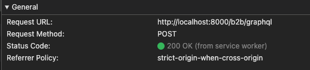
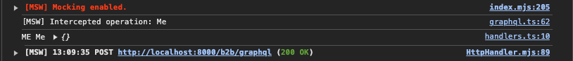
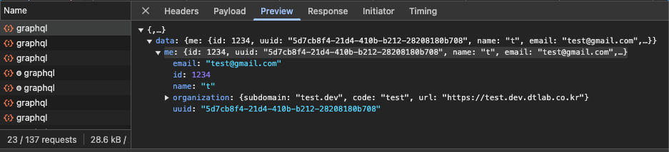

## 문제 배경

Next.js 15 + GraphQL 조합에서 msw(2.6.6)를 적용했을 때, msw의 `graphql.query` / `graphql.mutation` 핸들러가 GraphQL operation을 가로채지(intercept) 못하는 문제를 겪었다.

같은 증상을 겪은 사례는 아래 discussion에서도 확인할 수 있다.

https://github.com/mswjs/msw/discussions/1049

> 이 글은 당시의 진단과 해결 과정을 그대로 담았다. 나중에 확인한 실제 원인과 더 나은 접근은 [말미의 회고](#회고--이후-알게-된-것)에 정리했다.

## 문제 해결 방법

당시에는 GraphQL operation을 직접 가로챌 방법이 없다고 판단했고, 다른 우회로를 찾아야 했다.

그것은 바로, GraphQL이 결국 하나의 endpoint로 향하는 POST 요청이라는 점을 이용해 `http.post` 레벨에서 직접 가로채는 것이다.



GraphQL api를 요청하는 방법을 생각해보면 하나의 endpoint에 `POST` 메소드를 통해서 요청한다. 그리고, 네트워크 탭의`Payload` 에서 확인하면 알 수 있듯이 `operationName`,
`variables`, `query` 를 통해 요청할 api 이름, 변수, 그리고 query 혹은 mutation field를 알 수 있다.

```json
{
  "operationName": "Me",
  "variables": {},
  "query": "query Me {...}"
}
```

`src > mocks` 경로에 msw 적용을 위한 값들을 세팅해준다.

```text
src/mocks
├── browser.ts
├── graphql.ts
├── handlers.ts
├── initServerMsw.ts
└── server.ts
```

```tsx
// browser.ts

import { setupWorker } from 'msw/browser';

import { handlers } from './handlers';

export const worker = setupWorker(...handlers);
```

```tsx
// server.ts

import { setupServer } from 'msw/node';

import { handlers } from './handlers';

export const server = setupServer(...handlers);
```

```tsx
// initServerMsw.ts

export async function initServerMsw() {
  if (typeof window === 'undefined') {
    const { server } = await import('./server');
    server.listen({ onUnhandledRequest: 'bypass' });
  }
}
```

여기까지는 msw 공식 문서에서 확인할 수 있는 기본적인 세팅 방법이다.

참고로, 핸들러에 매칭되지 않은 요청을 msw가 어떻게 처리할지는 `onUnhandledRequest` 옵션이 결정하는데, 기본값 `warn`은 "경고를 출력하고 요청을 그대로 수행"한다. 즉 GraphQL 외의 요청(GET 등)은 별도의 제외 핸들러 없이도 원본 서버로 통과된다. 콘솔 경고까지 없애고 싶다면 위의 `server.listen`처럼 `worker.start({ onUnhandledRequest: 'bypass' })` 옵션만 주면 된다.

이제 아래와 같이 gqlHandlers에 필요한 handler를 추가하면 필요한 함수들만 모킹해주는 것을 확인할 수 있다.

```tsx
// handler.ts

import { gqlHandlers } from './graphql';

export const handlers = [ gqlHandlers({}) ];
```

마지막으로, 핵심 로직인 gqlHandlers의 내부를 살펴보도록 하자.

### 1. `parseRequestBody` 함수

```tsx
async function parseRequestBody(
  request: Request,
): Promise<GqlOperation | GqlOperation[] | null> {
  try {
    return await request.clone().json();
  } catch (error) {
    console.error('[MSW] Failed to parse JSON:', error);
    return null;
  }
}
```

- **Request 복제**: `request.clone()`을 통해 원본 Request 객체를 복제합니다.
    - Request 객체의 body는 한 번 읽으면 다시 사용할 수 없기 때문에, 복제본을 사용하여 `json()`을 안전하게 호출합니다.
- **JSON 파싱**: 복제본의 `json()` 메서드를 호출해 요청 본문을 JSON으로 파싱합니다.
- **에러 처리**: 만약 파싱에 실패하면 콘솔에 에러를 출력하고 `null`을 반환합니다.
    - 이후 로직에서 `null`을 만나면 `passthrough()`로 원본 서버에 요청을 넘기도록 처리합니다.

### 2. `createGraphQLInterceptor` 함수

```tsx
function createGraphQLInterceptor(operationHandlers: GqlHandler) {
  // 1. 핸들러가 비어 있으면 passthrough만 수행하는 핸들러를 반환
  if (!Object.keys(operationHandlers).length) {
    return http.post(BASE_URL, passthrough);
  }

  // 2. 핸들러가 있는 경우
  return http.post(BASE_URL, async ({ request, cookies }) => {
    // 2-1. 요청 본문 파싱 — 실패 시 원본 서버로 요청 전달
    const parsedBody = await parseRequestBody(request);
    if (!parsedBody) {
      return passthrough();
    }

    // 2-2. batch 요청(operation 2개 이상)은 단일 응답으로 답할 수 없으므로
    //      모킹하지 않고 원본 서버로 전달
    if (Array.isArray(parsedBody) && parsedBody.length > 1) {
      console.warn('[MSW] Batched GraphQL requests are not supported. Passing through.');
      return passthrough();
    }

    // 2-3. batchMax: 1 환경에서는 body가 길이 1의 배열로 오므로 단일 operation으로 정규화
    const { operationName, query, variables } = Array.isArray(parsedBody)
      ? parsedBody[0]
      : parsedBody;

    // 2-4. operationName에 대응하는 핸들러가 없으면 원본 서버로 전달
    const handler = operationHandlers[operationName];
    if (!handler) {
      return passthrough();
    }

    // 2-5. 핸들러를 호출하고 결과를 응답으로 반환
    console.info(`[MSW] Intercepted operation: ${operationName}`);
    return handler({ request, query, variables, operationName, cookies });
  });
}
```

### 3. `gqlHandlers` 함수

```tsx
export function gqlHandlers(handlers: GqlHandler) {
  return createGraphQLInterceptor(handlers);
}
```

- 외부에서 **핸들러 객체**(operationName을 키로 하고, 각각에 대응하는 처리 함수를 값으로 갖는 객체)를 받아서, 내부적으로 `createGraphQLInterceptor`를 생성해 반환합니다.

## 최종 코드

```tsx
import { http, passthrough } from 'msw';

export interface GqlOperation {
  operationName: string;
  query: string;
  variables: Record<string, unknown>;
}

export interface GqlHandler {
  [operationName: string]: (
    args: GqlOperation & {
      request: Request;
      cookies: Record<string, string>;
    },
  ) => Response | Promise<Response>;
}

const BASE_URL = `${process.env.NEXT_PUBLIC_BASE_URL}/graphql`;

async function parseRequestBody(
  request: Request,
): Promise<GqlOperation | GqlOperation[] | null> {
  try {
    // Request body는 한 번 읽으면 재사용할 수 없으므로 복제본으로 파싱한다
    return await request.clone().json();
  } catch (error) {
    console.error('[MSW] Failed to parse JSON:', error);
    return null;
  }
}

function createGraphQLInterceptor(operationHandlers: GqlHandler) {
  if (!Object.keys(operationHandlers).length) {
    return http.post(BASE_URL, passthrough);
  }

  return http.post(BASE_URL, async ({ request, cookies }) => {
    const parsedBody = await parseRequestBody(request);
    if (!parsedBody) {
      return passthrough();
    }

    if (Array.isArray(parsedBody) && parsedBody.length > 1) {
      console.warn('[MSW] Batched GraphQL requests are not supported. Passing through.');
      return passthrough();
    }

    const { operationName, query, variables } = Array.isArray(parsedBody)
      ? parsedBody[0]
      : parsedBody;

    const handler = operationHandlers[operationName];
    if (!handler) {
      return passthrough();
    }

    console.info(`[MSW] Intercepted operation: ${operationName}`);
    return handler({ request, query, variables, operationName, cookies });
  });
}

export function gqlHandlers(handlers: GqlHandler) {
  return createGraphQLInterceptor(handlers);
}
```

### 사용 예시

```tsx
import { HttpResponse } from 'msw';

import { gqlHandlers, type GqlHandler } from './graphql';

const userHandlers: GqlHandler = {
  Me: () =>
    HttpResponse.json({
      data: {
        me: {
          id: 1234,
          uuid: '5d7cb8f4-21d4-410b-b212-28208180b708',
          name: 't',
          email: 'test@gmail.com',
          organization: {
            subdomain: 'test.dev',
            code: 'test',
            url: 'https://test.example.com',
          },
        },
      },
    }),
};

export const handlers = [ gqlHandlers({ ...userHandlers }) ];
```

### 모킹에 성공한 실제 화면





성공적으로 모킹한 것을 확인할 수 있다!

추가적으로, GraphQL의 batch 기능을 사용하면 여러 operation이 하나의 배열 body로 묶여 요청된다. 이 인터셉터는 요청 하나에 응답 하나를 돌려주는 구조라 배열 형태의 batch 응답을 만들 수 없고, 그래서 위 코드에서도 batch 요청은 모킹하지 않고 passthrough로 흘려보낸다. 모킹을 사용하는 환경(dev)에서는 batch 기능을 꺼주도록 하자.

이때 주의할 점이 하나 있다. `BatchHttpLink`의 `batchMax`는 falsy 값이면 기본값 10으로 폴백되기 때문에(`this.batchMax = batchMax || 10`), `batchMax: 0`은 "배칭 끄기"가 아니라 기본값 10과 동일하게 동작한다. 의도를 드러내려면 아래처럼 명시적으로 적는 편이 안전하다.

```tsx
const batchHttpLink = new BatchHttpLink({
  fetch,
  uri,
  // dev: 배치당 operation 1개 → 요청이 개별 전송된다 (사실상 배칭 비활성화)
  batchMax: process.env.NEXT_PUBLIC_ENV === 'prod' ? 10 : 1,
});
```

## 회고 — 이후 알게 된 것

글을 쓴 뒤 이 문제를 다시 파보면서, 당시 내린 진단이 정확하지 않았다는 걸 알게 됐다. 기록을 남겨둔다.

### 1. 진짜 원인은 batching이었다

`graphql.query` 핸들러가 동작하지 않은 이유는 Next.js도, msw의 GraphQL 지원 부족도 아니었다. **Apollo `BatchHttpLink`를 쓰고 있었기 때문**이다.

`BatchHttpLink`는 operation이 **하나뿐이어도 항상 배열로 직렬화**한다.

```ts
// apollo-client/src/link/batch-http/batchHttpLink.ts
const loadedBody = optsAndBody.map(({ body }) => body); // 항상 배열
options.body = serializeFetchParameter(loadedBody, 'Payload');
```

그런데 msw는 요청 body의 **최상위에 `query` 키가 있어야만** GraphQL 요청으로 인식한다.

```ts
// msw/src/core/utils/internal/parseGraphQLRequest.ts
const requestJson = await requestClone.json().catch(() => null);
if (requestJson?.query) {
  return { query, variables };
}
return null; // ← 배열 body는 여기로 떨어진다
```

`[{ query: ... }]`에는 최상위 `query`가 없으니 `null`이 반환되고, 그 결과 `graphql.*` 핸들러는 매칭 자체가 이뤄지지 않는다. **`BatchHttpLink`를 쓰는 한 `batchMax`를 어떻게 조정해도 공식 핸들러는 동작할 수 없는 구조였다.** 본문에서 batch를 끈 것이 문제를 해결한 것처럼 보였지만, 실제로 한 일은 "커스텀 인터셉터가 다룰 수 있는 형태로 요청을 단순화"한 것이었다.

query batching은 [GraphQL 스펙](https://spec.graphql.org/)에도, GraphQL-over-HTTP 스펙에도 없는 기능이라 msw가 이를 기본 지원하지 않는 것은 의도된 동작이다.

### 2. 참고했던 discussion은 다른 문제였다

문제 배경에서 인용한 [discussion #1049](https://github.com/mswjs/msw/discussions/1049)는 2022년 1월에 작성된 글이고, 메인테이너가 진단한 원인은 **worker 등록이 끝나기 전에 요청이 발생하는 race condition**이다. 해결책도 deferred mounting으로, GraphQL 파싱과는 무관하다.

증상("Next.js dev 환경에서 MSW가 GraphQL을 인터셉트하지 못한다")이 내 상황과 정확히 일치했기 때문에 거기서 탐색을 멈췄고, 그 프레임에 갇혀 "Next.js와 msw의 통합 문제"로 규정해버렸다. **증상이 같다고 원인이 같은 것은 아니다.** 라이브러리가 예상대로 동작하지 않을 때는 이슈를 검색하기보다 `parseGraphQLRequest` 같은 파싱 지점을 직접 열어보는 편이 훨씬 빨랐을 것이다.

### 3. 공식 레시피가 이미 있었다

msw는 v2.1.3(2024-01)부터 `getResponse`를 공개 API로 제공하고, [Query batching 문서](https://mswjs.io/docs/graphql/mocking-responses/query-batching)에 Apollo용 구현을 안내하고 있었다. 배치 요청을 개별 요청으로 풀어 기존 `graphql.*` 핸들러에 위임하고, 결과를 배열로 재조립하는 방식이다.

```js
import { http, HttpResponse, getResponse, bypass } from 'msw';

export function batchedGraphQLQuery(url, handlers) {
  return http.post(url, async ({ request }) => {
    const requestClone = request.clone();
    const payload = await request.clone().json();

    // 배치가 아닌 요청은 다른 핸들러가 처리하도록 넘긴다
    if (!Array.isArray(payload)) {
      return;
    }

    const responses = await Promise.all(
      payload.map(async (query) => {
        const queryRequest = new Request(requestClone, {
          body: JSON.stringify(query),
        });
        const response = await getResponse(handlers, queryRequest);
        return response || fetch(bypass(queryRequest));
      }),
    );

    const queryData = await Promise.all(responses.map((response) => response?.json()));

    return HttpResponse.json(queryData);
  });
}
```

```ts
const graphqlHandlers = [
  graphql.query('Me', () => HttpResponse.json({ data: { me: { id: 1234 } } })),
];

export const handlers = [
  batchedGraphQLQuery('/graphql', graphqlHandlers),
  ...graphqlHandlers,
];
```

주목할 만한 차이가 하나 있다. 배치가 아닌 요청에서 이 레시피는 `passthrough()`가 아니라 **`return`(undefined)** 을 반환한다. `passthrough()`는 "이 요청을 원본 서버로 실행하라"는 종결 명령이라 뒤의 핸들러를 시도하지 않지만, `undefined`는 다음 핸들러로 넘긴다. 그래서 공식 방식은 다른 핸들러와 조합되고, `server.use()`로 특정 operation만 덮어쓰는 것도 가능하다. 본문의 커스텀 인터셉터는 매칭 실패 시 `passthrough()`로 종결하기 때문에 이런 조합이 불가능하다.

### 4. 무엇을 잃었나

msw도 batching은 기본 지원하지 않으므로 **공식 레시피 역시 `http.post`로 가로채는 커스텀 코드**다. 접근 방향 자체는 같았고, 차이는 파싱한 operation을 자체 map에 매칭하느냐 `graphql.*` 핸들러에 위임하느냐 하나였다. 그 하나 때문에 잃은 것들:

| 잃은 것 | 공식 방식 |
|---|---|
| codegen 타입 연동 | `graphql.query<Query, Vars>(GetUserDocument, …)` — TypedDocumentNode 지원 |
| query / mutation 구분 | `graphql.query` vs `graphql.mutation` (현재는 operationName만 키로 사용) |
| 정규식 매칭 | `graphql.mutation(/user/i, …)` |
| `once` 옵션 | `graphql.query('X', resolver, { once: true })` |
| `server.use()` 단건 오버라이드 | 테스트별로 한 operation만 교체 후 `resetHandlers()` |
| 멀티 엔드포인트 | `graphql.link('https://api.example.com/graphql')` |
| 파일 업로드(multipart) | msw가 multipart GraphQL 파싱 지원 |

다만 가장 아쉬운 건 기능 손실보다 **batching을 꺼야 했다는 점**이다. dev와 prod의 Apollo 링크 설정이 갈라지면 배포하는 것과 다른 것을 개발하게 되고, batch 경로에서만 발생하는 버그는 개발 환경에서 영원히 재현되지 않는다. 공식 레시피를 썼다면 batching을 켠 채로 모킹할 수 있어 이 분기 자체가 사라진다.

지금 다시 같은 상황을 만난다면 공식 레시피를 사용할 것이다.

## Reference

- https://mswjs.io/
- https://github.com/mswjs/msw/discussions/1049
- https://mswjs.io/docs/graphql/mocking-responses/query-batching
- https://github.com/mswjs/msw/issues/510
- https://github.com/mswjs/msw/blob/main/src/core/utils/internal/parseGraphQLRequest.ts
- https://github.com/apollographql/apollo-client/blob/v3.13.1/src/link/batch-http/batchHttpLink.ts
